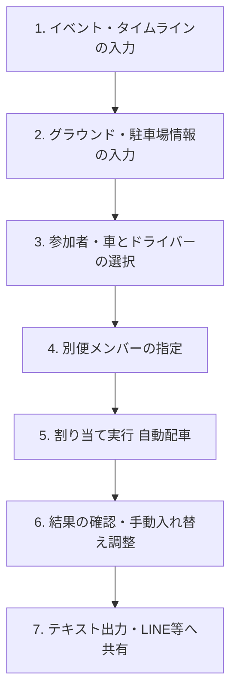

# 配車調整機能 利用者マニュアル

本システムは、少年野球チーム「Arinko Ants（ありんこアントス）」の活動におけるイベント時の配車（メンバーの乗り分け・駐車場の割り当て）を自動的に行い、手動での微調整を経て、LINE等にそのまま貼り付けられる案内テキストを素早く作成・共有するためのシステムです。

---

## 1. 配車調整の全体フロー

配車作成は、以下のステップで進めます。



---

## 2. 各セクションの入力と操作方法

### 2.1. イベント日とイベント名 / タイムライン・特記事項（セクション 1 & 2）
イベントの基本情報と、当日のスケジュール等の連絡事項を入力します。

- **イベント日**: 例：`2026/6/14(日)`
- **イベント名**: 例：`vs向小金ファイターズ(富士見橋大会A)`
- **イベントタイムライン**: 集合時間や出発時間、グランド入り時刻などを入力します（改行可）。
  - *入力例*:
    ```text
    ⭕️東小集合 08:30
    ⭕️東小出発 08:40
    ⭕️グランドイン 08:50
    ⭕️試合開始 10:00
    ※アントスホーム扱い
    ```
- **その他特記事項**: 持ち物や注意事項を入力します。例：`・お弁当持参` `・マナーパンツ着用`

---

### 2.2. グラウンド・駐車場情報（セクション 3）
目的地（遠征先など）の駐車場ルールを入力します。この設定に基づいて、車が「指定駐車場」と「それ以外の駐車場」に自動で振り分けられます。

- **グラウンド名**: 例：`千葉県特別支援学校流山高等学校`
- **指定駐車場の名称**: 例：`千葉県特別支援学校流山高等学校（校内）`
- **台数制限**: 指定駐車場に停められる最大台数を入力します（例：台数制限が `6` 台の場合、割り当てられた車のうち上位6台が指定駐車場になり、7台目以降は自動的に「指定以外」に分類されます。制限がない・または広い場合は `99` などを入力します）。
- **備考 (指定駐車場)**: 地図のURLや、現地での駐車ルールを入力します。
  - *入力例*:
    ```text
    https://maps.app.goo.gl/2UZ7c8FeGmPKDgeB7
    駐車場は奥から停めないといけないので、
    ①テニスコート横
    ②体育館裏
    ③正門入って左側　この順でお願いします。
    ```
- **指定以外の駐車場の名称**: 例：`（その他駐車場）` や `丘の上駐車場`
- **備考 (指定以外)**: 指定以外の駐車場に関する案内や駐車料金等のルールを入力します。

---

### 2.3. 参加者を選択（セクション 4）
マスターデータに登録されている家族の一覧が表示されます。
- **参加チェック**: 参加するメンバーのチェックボックスにチェックを入れます。
- **全員参加 / 全員不参加ボタン**: 家族ごとに一括でチェックを切り替えることができます。
- **学年・学校・その他・備考の入力**:
  - 選手の場合は「学年」「学校」「その他」が入力可能です（自動配車の際に、同じ学年や学校の選手同士が同じ車になりやすくなるように考慮されます）。
  - 各自の「備考」に入力した内容は、最終的な配車結果カードや出力テキストに反映されます（例：「遅刻のため現地集合」「現地で荷物受け取り」など）。
- **すべて閉じる / すべて開くボタン**: 家族のアコーディオン表示を一括で開閉できます。

---

### 2.4. 車とドライバーを選択（セクション 5）
当日出すことができる「車」を選択します。
- **車の選択**: 使用する車のチェックボックスをオンにします。オンにすると、以下のオプションが表示されます。
- **ドライバー選択**: プルダウンから当日のドライバー（保護者等）を選択します。
  - *重要*: ドライバーに選ばれたメンバーは、参加者リストでチェックが入っている必要があります。
- **荷物あり (2名制限)**: チームの大きな荷物や道具車として使用する場合にチェックを入れます。これにチェックを入れると、乗車可能人数が**実質2名（運転手 ＋ 同乗者1名）**に制限され、多くのメンバーが乗らないように自動調整されます。

---

### 2.5. 参加者一覧（別便の人をチェック）（セクション 6）
チェックを入れた参加者のうち、自車で現地に直接向かう（配車に含めない）メンバーをチェックします。
- **別便指定**: ここでチェックを入れたメンバーは、車への割り当てから除外され、結果の「◆別便」グループに分類されます。
- *注意*: 車のドライバーに選ばれているメンバーは、別便に指定することはできません。

---

## 3. 割り当ての実行（自動配車ルール）

「**割り当て実行**」ボタンを押すと、以下のアルゴリズムに基づいてメンバーが自動的に各車へ配車されます。

### 3.1. 自動配車の優先ルール
1. **ドライバーの確定**: 選択されたドライバーが各車の運転席に割り当てられます。
2. **家族優先ルール**: ドライバーと同じ家族（選手、兄弟、他の保護者）が、優先的に同じ車に割り当てられます。
3. **同学年・同学校優先ルール**: 余った選手は、すでにその車に乗っている選手と「学年」や「学校」が同じになるように優先的に割り当てられます。これにより、低学年の選手が一人だけで別の車に乗るような事態を防ぎます。
4. **同乗優先（マスタ設定）の考慮**: マスタデータで「同乗優先」が有効になっているメンバーが優先的に車に割り当てられます。
5. **駐車場の自動分類**: 設定された「指定駐車場の台数制限」に基づき、車が上から順番に「指定駐車場」へ割り当てられます。上限を超えた車は自動的に「指定以外」に割り当てられます。

### 3.2. すでに結果が存在する場合の挙動
すでに配車結果を作成した状態で再度「割り当て実行」を押した場合、以下の確認ダイアログが表示されます。

- **現在の状態を【維持】して実行する (Keep)**:
  - すでに決まっているメンバーの乗車位置（手動で調整した結果など）を極力キープしたまま、新しく追加されたメンバーや不参加に変更になったメンバーの差分だけを再配車します。
- **【全てリセット】してやり直す**:
  - 現在の配車状態をクリアし、完全に最初から自動配車を計算し直します。

---

## 4. 割り当て結果の確認と手動調整（セクション 7）

自動配車が終わると、画面下部に結果がカード形式で表示されます。

### 4.1. 結果カードの表示項目
- **車のヘッダー**: 「車名」「総定員」「空席数」が表示されます。
- **[D] マーク**: ドライバー（運転手）を示します。青い背景で表示されます。
- **★ マーク**: 選手を示します。名前の横に学年や学校名、および備考が表示されます。
- **-- 空席 --**: 空いている座席です。
- **◆別便**: 車に乗らないメンバーが「合計◯名」として一覧表示されます。

### 4.2. 手動入れ替え（スワップ機能）
自動配車の結果をドラッグ不要で簡単に入れ替えることができます。

#### ① メンバー（または空席）を入れ替える
1. 移動させたいメンバー（または空席、別便枠）の左側にある**チェックボックスをオン**にします（選択されると枠が緑色になります）。
2. 移動先（別の車の席、あるいは空席、別便枠）の**チェックボックスをオン**にします。
3. **2つ目のチェックを入れた瞬間に、自動で2人の位置（または空席）が入れ替わります。**

*※「別便へ移動」にチェックを入れることで、乗車していたメンバーを別便へ移すことも簡単にできます。*

#### ② 車の駐車場割り当て（または表示順）を入れ替える
1. 車のヘッダーにあるチェックボックスをオンにします。
2. 別の車のヘッダーにあるチェックボックスをオンにします。
3. **2つの車が入れ替わります。**
   - 同じ駐車場グループ内（例：指定駐車場の中）であれば、**表示順（並び順）**が入れ替わります。
   - 異なる駐車場グループ間（例：指定駐車場 ↔ 指定以外）であれば、**駐車場の割り当て属性**が入れ替わります。これにより、「この車を指定駐車場にして、あの車を指定外に回す」といった調整がワンクリックで行えます。

---

## 5. テキスト出力と共有

配車結果の調整が完了したら、右上の「**テキスト出力**」ボタンを押します。

1. コピー用のテキストエリアが表示され、LINEや連絡アプリにそのまま貼り付けられるフォーマットのテキストが生成されます。
2. 「**コピー**」ボタンを押すと、クリップボードにコピーされます。そのままLINE等のメッセージ入力欄にペーストして送信してください。

---

## 6. 管理メニュー・メッセージの使い方（データの保存・復元）

画面最上部の「管理メニュー・メッセージ ▼」を開くと、以下のデータ管理が行えます。

### ① 配車データ (DB保存)
現在編集中のイベント情報、参加者選択状態、配車割り当て結果をデータベース（サーバー）に保存・復元できます。
- **保存**: イベント名等を入力して「保存」を押すと、現在の配車状態がサーバーに保存されます。
- **読込**: 過去に保存した配車データをプルダウンから選択し、「読込」を押すことで復元できます。
- **削除**: 不要になった保存データをサーバーから削除します。

### ② グラウンド・駐車場
よく行く遠征先やグラウンドの駐車場情報をデータベースに保存・復元できます。
- **保存**: 入力したグラウンド名・駐車場名・制限台数・備考を保存します。
- **読込**: 以前保存したグラウンドをプルダウンから選択して読み込みます。

### ③ ファイル出力 (ローカル保存)
データをJSONファイル形式でローカルPCにダウンロード、またはファイルから読み込みます。サーバーの通信状態が悪い場合や、バックアップを手元に残したい場合に使用します。
- **保存**: パソコン等に `.json` ファイルとして保存します。
- **読込**: 保存した `.json` ファイルを選択してデータを復元します。

### ④ アプリ管理
- **マスターへ**: 後述の「マスターデータ管理」画面へ移動します。
- **全リセット**: データベース内の登録データ（マスターデータ・配車データ等すべて）を完全に初期化します。※実行には注意してください。

---

## 7. マスターデータ管理（配車マスタ）

配車調整をスムーズに行うため、あらかじめメンバーや車、駐車場のデフォルトデータを登録・管理する画面です。

### 7.1. 家族データ
- **新しい家族の追加**: 「＋ 新しい家族」ボタンから追加します。
- **メンバーの追加・削除**: 家族カード内の「＋ メンバー」ボタンで家族構成員（選手、保護者、兄弟など）を追加します。
- **同乗優先（チェックボックス）**: 
  - 選手などにチェックを入れると、自動配車時にドライバー（家族）の車に優先して同乗させます。
- **並び順の調整**: 「▲」「▼」ボタンで、配車調整画面での家族の表示順を変更できます。

### 7.2. 車データ
当活動で使用可能な車を登録します。
- **新規追加**: 「＋ 新しい車」ボタンから追加します。
- **所属家族**: どの家族の車かを紐付けます（これにより自動配車時にその家族が優先的に乗車します）。
- **定員**: 運転手を含めた乗車可能人数を設定します。

### 7.3. 駐車場（グラウンド）データ
よく使うグラウンドのデフォルト情報を登録します。

---

### 💡 重要：マスターデータの保存（更新）について
画面上部に表示されている「**マスターデータを保存 (更新)**」ボタンを押すまで、画面上で行った追加・変更・削除はサーバーに保存されません。編集が終わったら**必ずこのボタンを押して保存を確定**させてください。

---

## 8. 管理者向け機能：操作ログの確認およびユーザーパスワードの変更

管理者（adminロール）ユーザーは、システムの保守・運用のために以下の管理機能を利用できます。

### 8.1. 操作ログの確認
マスターデータ管理画面の下部には「**操作ログ**」が表示されます。
- **ログの目的**: 誰がいつ、どのようなマスタ更新やデータベース全リセットなどの操作を行ったかを監視・確認し、誤操作時の原因究明に役立てます。
- **CSVダウンロード**: 「CSVダウンロード」ボタンを押すと、すべての操作ログをCSVファイルとしてダウンロードしてExcel等で確認・保管できます。

### 8.2. ユーザーパスワードの直接変更（強制変更）
メール送信制限を回避しているため、管理者がユーザー一覧から特定のユーザーのパスワードをその場で直接書き換えることができます。
- **操作手順**:
  1. 「メンバー・マスタ管理」➔ 「ユーザー管理」の一覧を表示します。
  2. 対象ユーザーの右側にある「**パスワード変更**」ボタンを押します。
  3. 新しいパスワード（6文字以上）を入力して確定すると、確認メール等を送信せずに即座にパスワードが更新されます。
- **事前設定 (Supabase管理者用)**:
  この機能を有効にするには、Supabase Dashboardの **SQL Editor** で以下のSQLスクリプトを実行し、セキュリティで保護されたデータベース関数（RPC）を事前に定義しておく必要があります。

```sql
-- 管理者が他ユーザーのパスワードを強制変更できるセキュアな関数を定義
create or replace function admin_update_user_password(user_email text, new_password text)
returns void as $$
declare
  caller_role text;
begin
  -- 操作実行者のロール（app_users テーブルに登録されている role）を取得
  select role into caller_role
  from public.app_users
  where email = auth.jwt()->>'email';

  -- 実行者が管理者（admin）ではない場合は拒否
  if caller_role != 'admin' or caller_role is null then
    raise exception 'Unauthorized: Only administrators can change passwords.';
  end if;

  -- auth.users のパスワードハッシュを直接更新 (bcryptハッシュ)
  update auth.users
  set encrypted_password = extensions.crypt(new_password, extensions.gen_salt('bf'))
  where email = user_email;
end;
$$ language plpgsql security definer
set search_path = public, extensions;
```

---

## 9. 具体的な使用例（千葉県特別支援学校流山高等学校への遠征）

実際の入力・出力例を参考に、配車作成のイメージを掴んでみましょう。

### 9.1. 入力値の例
- **イベント日**: `2026/6/14(日)`
- **イベント名**: `vs向小金ファイターズ(富士見橋大会A)`
- **イベントタイムライン**: 
  ```text
  ⭕️東小集合 08:30
  ⭕️東小出発 08:40
  ⭕️グランドイン 08:50
  ⭕️試合開始 10:00
  ※アントスホーム扱い
  ```
- **グラウンド名**: `千葉県特別支援学校流山高等学校`
- **指定駐車場の名称**: `千葉県特別支援学校流山高等学校（校内）`
- **台数制限**: `99` （制限に余裕があるため、全ての車が指定駐車場に停められるように設定）
- **備考 (指定駐車場)**: 
  ```text
  https://maps.app.goo.gl/2UZ7c8FeGmPKDgeB7
  駐車場は奥から停めないといけないので、
  ①テニスコート横
  ②体育館裏
  ③正門入って左側　この順でお願いします。
  ```
- **指定以外の駐車場の名称**: `（その他駐車場）`

### 9.2. 結果（自動配車とテキスト出力）のイメージ
割り当て実行後、すべての車（例：菱沼カー、近藤カー、小河原カー②、山田カー①、小野カー、浅野カー）が「指定駐車場（千葉県特別支援学校流山高等学校（校内））」内にカードとして配置されます。
- **「荷物あり」の車（例：浅野カー）**は、定員が自動的に2名に制限され、無駄な同乗が防がれています。
- **「別便」にチェックされたメンバー（例：木村代表）**は、車へ割り当てられずに「別便」グループにまとまります。

### 9.3. LINE・連絡用として出力されるテキストの例
「テキスト出力」を押した際に生成される実際のテキストイメージです。

```text
2026/6/14(日) vs向小金ファイターズ(富士見橋大会A) @千葉県特別支援学校流山高等学校

⭕️東小集合 08:30
⭕️東小出発 08:40
⭕️グランドイン 08:50
⭕️試合開始 10:00
※アントスホーム扱い

◆千葉県特別支援学校流山高等学校（校内）
https://maps.app.goo.gl/2UZ7c8FeGmPKDgeB7
駐車場は奥から停めないといけないので、
①テニスコート横
②体育館裏
③正門入って左側　この順でお願いします。
・菱沼カー (菱沼父, 菱沼母, つぐみ, ★颯介, 小高監督)
・近藤カー (近藤父, 近藤母, ★譲成, ★茉莉)
・小河原カー② (小河原母, ★維)
・山田カー① (山田父, ★颯真)
・小野カー (小野母, ★奏多)
・浅野カー (浅野母, ★歩, 荷物)

◆別便
・木村代表
```

※ 選手の名前の頭には自動的に `★` マークが付くため、誰が選手で誰が保護者なのか一目で判別できます。
